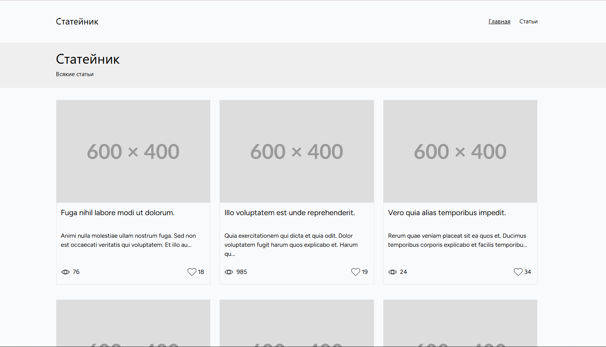
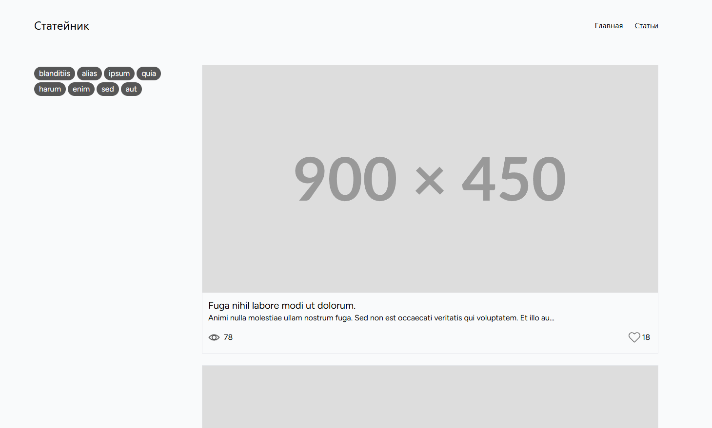
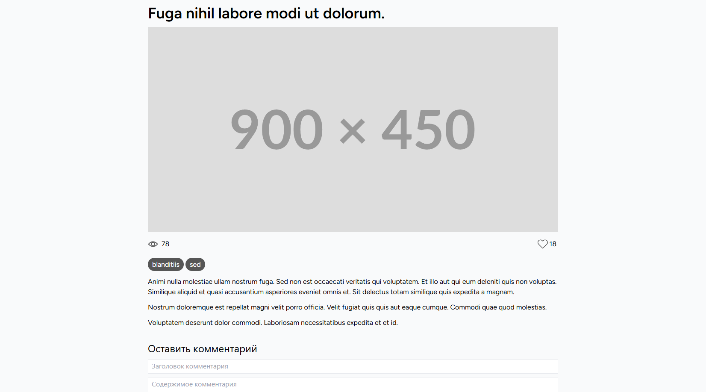

The simplest realization of a blog on Laravel, made in a day as a job application task.
Everything required by the task is working:
- 3 views: Home, Articles, Single
- Article Like/View API (Async AJAX)
- Article Comment API (Async AJAX, emulate time-consuming logic that shouldn't hurt user experience)
- Ready for testing (Data seeders in place to create articles, tags and comments)
Full task requirements: https://gist.github.com/an1creator/25e5428b6bb83e313541c18b0bb4c073

**Deployment:** 
git clone 
composer install 
npm install 
npm run build 
php artisan migrate 
php artisan db:seed 
php artisan serve 

